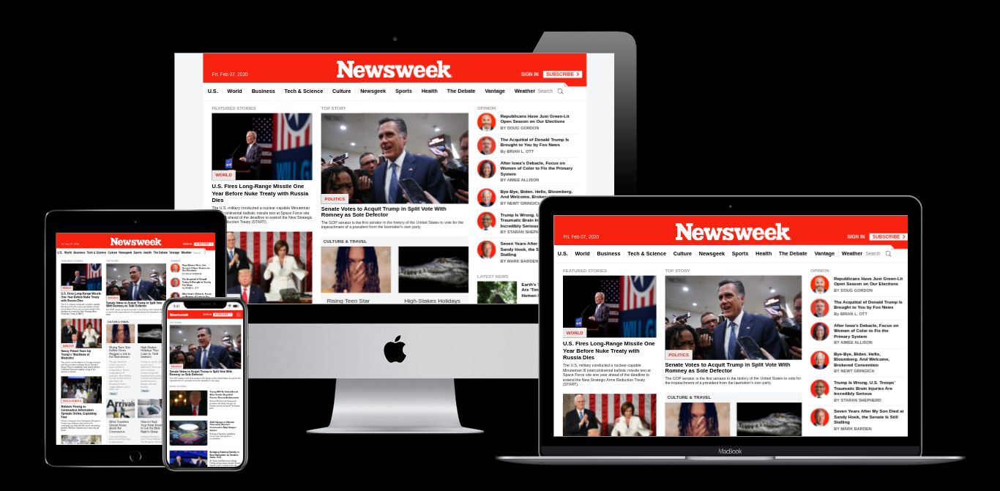

# Newsweek

> Welcome to the Newsweek portal!

## Implementation Details

[See wiki pages](https://github.com/cliftondavies/Newsweek/wiki)

## Tools & Technologies Used

- HTML5
- CSS3
- Bootstrap v4.4
- JavaScript ES6 >
- Font Awesome 5

## Live Demo

[Live Demo Link](https://cliftondavies.github.io/Newsweek/)

## Authors

👤 **Clifton Davies**

- Github: [@githubhandle](https://github.com/cliftondavies)
- Twitter: [@twitterhandle](https://twitter.com/cliftonaedavies)
- Linkedin: [linkedin](https://www.linkedin.com/in/clifton-davies-mbcs/)

## 🤝 Contributing

Contributions, issues and feature requests are welcome!

Feel free to check the [issues page](https://github.com/cliftondavies/Newsweek/issues).

## Show your support

Give a ⭐️ if you like this project!

## Acknowledgments

- [Techsini multi-mockup generator](https://techsini.com/multi-mockup/index.php)
- [Pesticide](https://github.com/mrmrs/pesticide)

## 📝 License

This project is [MIT](https://opensource.org/licenses/MIT) licensed.
